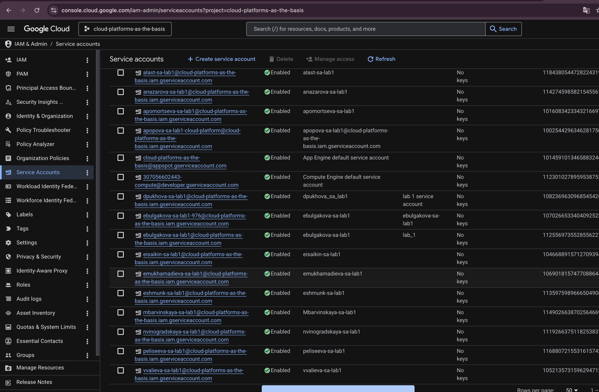
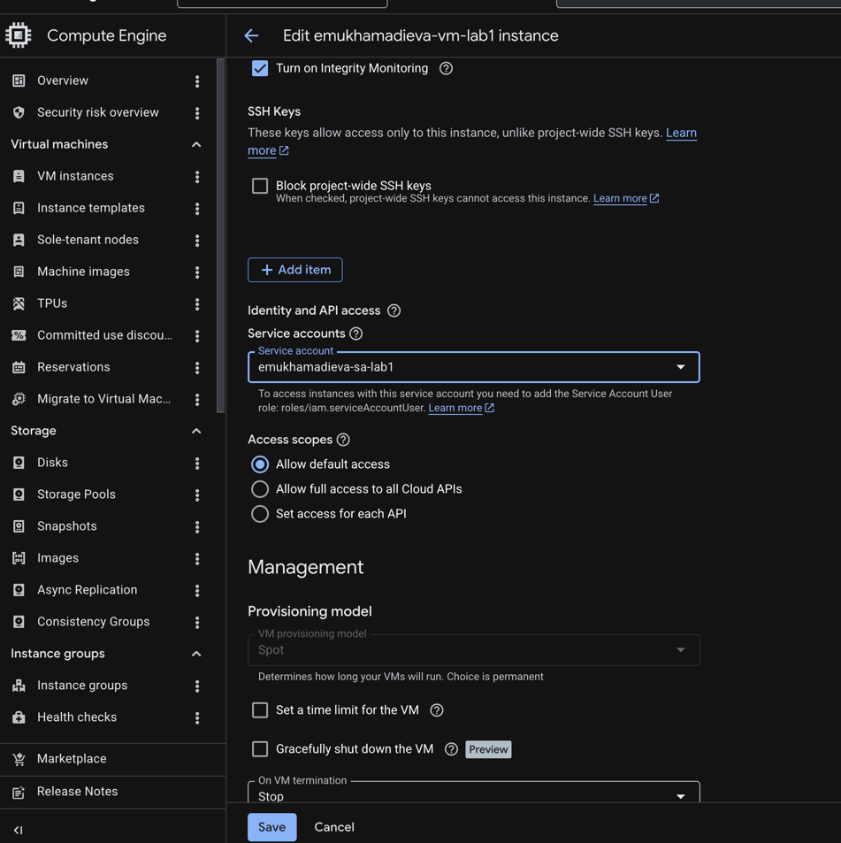
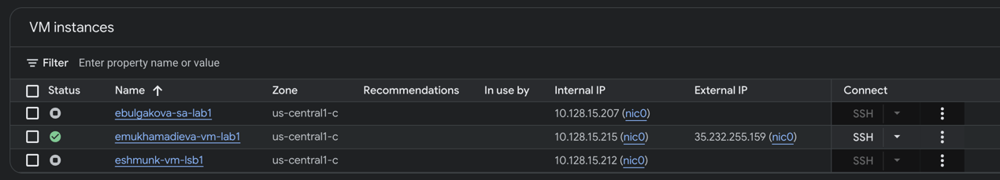
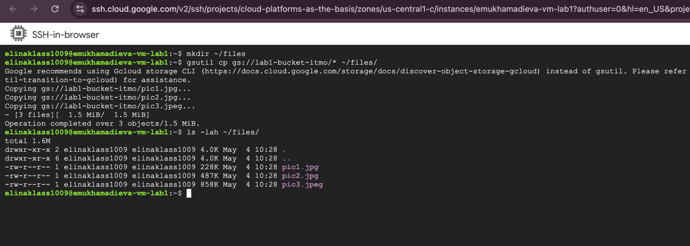
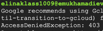

University: [ITMO University](https://itmo.ru/ru/) \
Faculty: [FICT](https://fict.itmo.ru) \
Course: [Cloud platforms as the basis of technology entrepreneurship](https://itmo-ict-faculty.github.io/cloud-platforms-as-the-basis-of-technology-entrepreneurship/) \
Year: 2025/2026 \
Group: U4125 \
Author: Mukhamadieva Elina Varisovna \
Lab: Lab1 \
Date of create: 04.05.2026 \
Date of finished: 04.05.2026

---

## Цель работы

Ознакомиться с основными возможностями и преимуществами облачной платформы Google Cloud.

---

## Ход работы

### 1. Создание сервисного аккаунта

В разделе **IAM → Service accounts** был создан сервисный аккаунт с именем `emukhamadieva-sa-lab1` и ролью **Storage Admin**.



---

### 2. Создание виртуальной машины

Создана виртуальная машина **emukhamadieva-vm-lab1** со следующими параметрами:
- Machine type: `e2-micro`
- Provisioning model: **Spot**
- Привязан сервисный аккаунт `emukhamadieva-sa-lab1`





---

### 3. Копирование файлов из бакета на VM

Подключившись к VM через SSH, была создана директория `~/files` и выполнено копирование всех файлов из бакета `lab1-bucket-itmo` с помощью `gsutil`:

```bash
mkdir ~/files
gsutil cp gs://lab1-bucket-itmo/* ~/files/
ls -lah ~/files/
```

Операция завершилась успешно — скопированы 3 файла (pic1.jpg, pic2.jpg, pic3.jpeg).



---

### 4. Смена роли и повторная попытка копирования

Роль сервисного аккаунта `emukhamadieva-sa-lab1` была изменена с **Storage Admin** на **Compute Viewer**.


После смены роли была предпринята повторная попытка скопировать файлы из бакета:

```bash
gsutil cp gs://lab1-bucket-itmo/* ~/files/
```

Результат - 403 ошибка доступа:



**Вывод:** роль **Compute Viewer** предоставляет права только на просмотр ресурсов Compute Engine и не включает доступ к Cloud Storage. Как только у сервисного аккаунта была отозвана роль Storage Admin, операции с бакетом стали недоступны - запрос был отклонён с ошибкой 403.
