University: [ITMO University](https://itmo.ru/ru/) \
Faculty: [FICT](https://fict.itmo.ru) \
Course: [Cloud platforms as the basis of technology entrepreneurship](https://itmo-ict-faculty.github.io/cloud-platforms-as-the-basis-of-technology-entrepreneurship/) \
Year: 2025/2026 \
Group: U4125 \
Author: Mukhamadieva Elina Varisovna \
Lab: Lab2 \
Date of create: 04.05.2026 \
Date of finished: 04.05.2026

## Цель работы

Ознакомиться с работой Cloud Run

## Ход работы

### 1. Создание сервиса Cloud Run

В консоли Google Cloud был создан новый сервис Cloud Run на основе стандартного образа `us-docker.pkg.dev/cloudrun/container/hello`. Сервис получил имя `emukhamadieva-hello-lab2`.

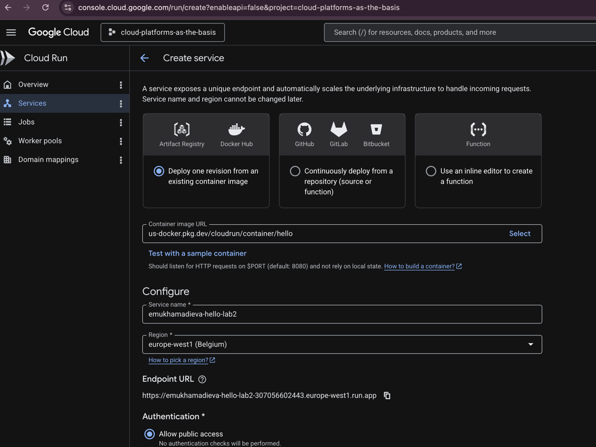

### 2. Успешное развёртывание сервиса

После создания все три этапа (Creating service, Creating revision, Routing traffic) завершились со статусом **Completed**. Была создана ревизия `emukhamadieva-hello-lab2-00001-gnx`, на которую направлено 100% трафика.

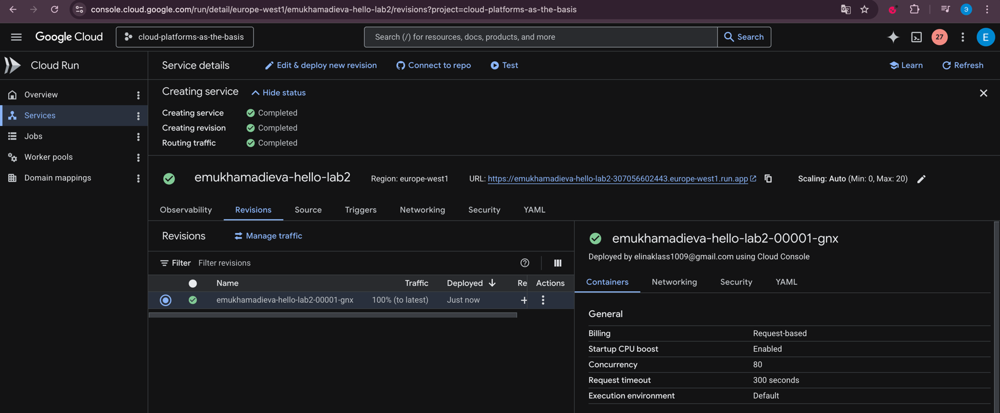

### 3. Анализ метрик

В разделе **Observability → Metrics** были изучены метрики сервиса за последние сутки:
- **Запросы и задержки:** количество запросов (Request count), задержки на уровнях 50/95/99 перцентилей (Request latencies), сквозная задержка (End-to-end request latency) и её декомпозиция по компонентам — ingress, routing, user execution (Latency breakdown).
- **Ресурсы контейнера:** количество активных инстансов (Container instance count), оплачиваемое время работы (Billable container instance time), утилизация CPU и памяти. Нагрузка минимальна, что соответствует тестовому сервису.
- **Сетевая активность:** входящий и исходящий трафик (Sent/Received bytes), максимальное число одновременных запросов (Max concurrent requests), задержка запуска контейнера (Container startup latency ~125–135ms).

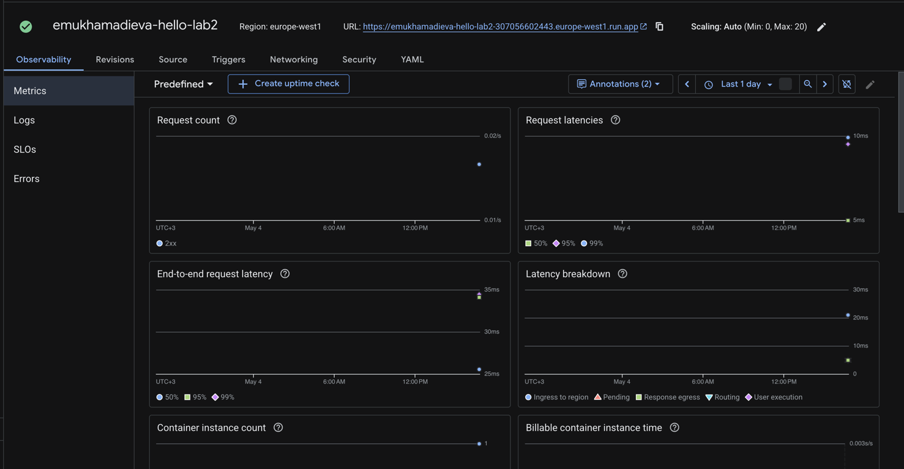

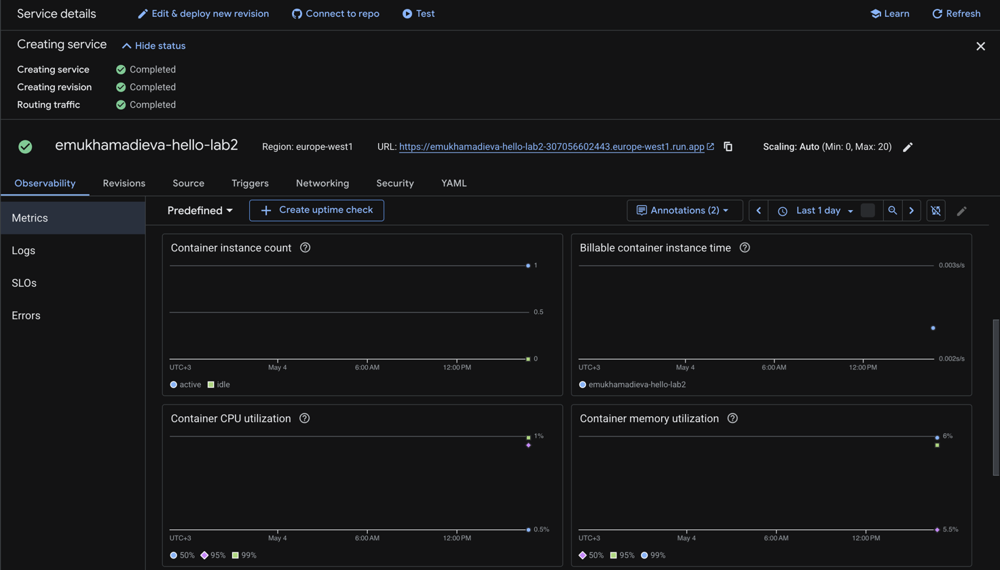

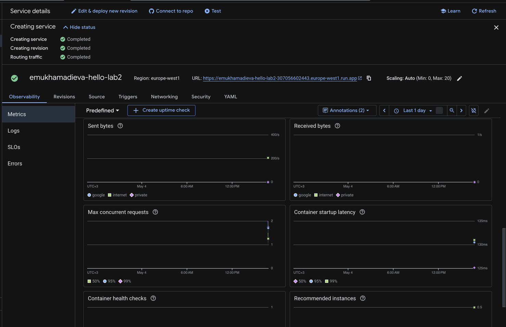

### 4. Анализ логов сервиса

В разделе **Observability → Logs** были просмотрены логи сервиса. Зафиксированы записи об успешном запуске контейнера и обработке входящих HTTP-запросов на порту 8080.

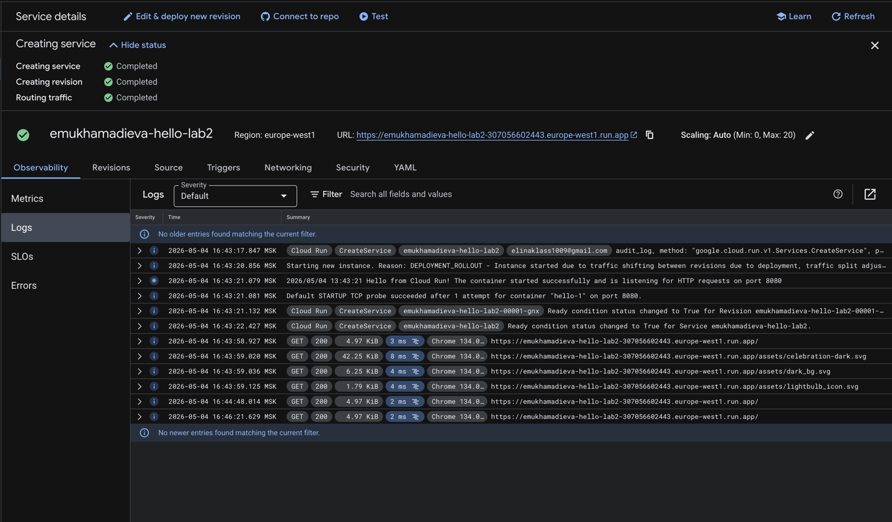

### 5. Изменение порта контейнера на 8090

Через **Edit & deploy new revision** был изменён порт контейнера с `8080` на `8090`.

Cloud Run является прокси между интернетом и контейнером — он принимает весь входящий трафик и сам перенаправляет его в контейнер. При смене порта в настройках Cloud Run делает единственное действие: передаёт новое значение внутрь контейнера через переменную окружения `$PORT=8090` и начинает форвардить туда запросы.

Образ `hello` не использует хардкод порта — при запуске он читает `$PORT` и слушает именно его. Поэтому сервис продолжил работать без ошибок независимо от того, какое значение выставлено в настройках.

Сломалось бы это только в том случае, если бы приложение игнорировало `$PORT` и всегда слушало фиксированный порт в коде — тогда Cloud Run стучался бы на 8090, а контейнер не отвечал.

Сам Cloud Run предупреждает об этом прямо в интерфейсе:
> *"Requests will be sent to the container on this port. We recommend listening on $PORT instead of this specific number."*

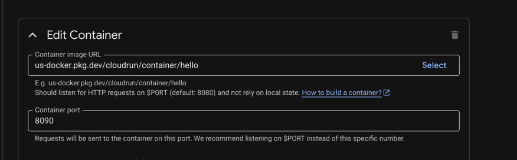

### 6. Тестирование сервиса по URL

Переход по URL сервиса (`emukhamadieva-hello-lab2-307056602443.europe-west1.run.app`) подтвердил успешную работу: отобразилась стандартная страница **"It's running!"** с информацией о созданной ревизии и проекте. Cloud Run автоматически масштабирует инстансы в зависимости от нагрузки.

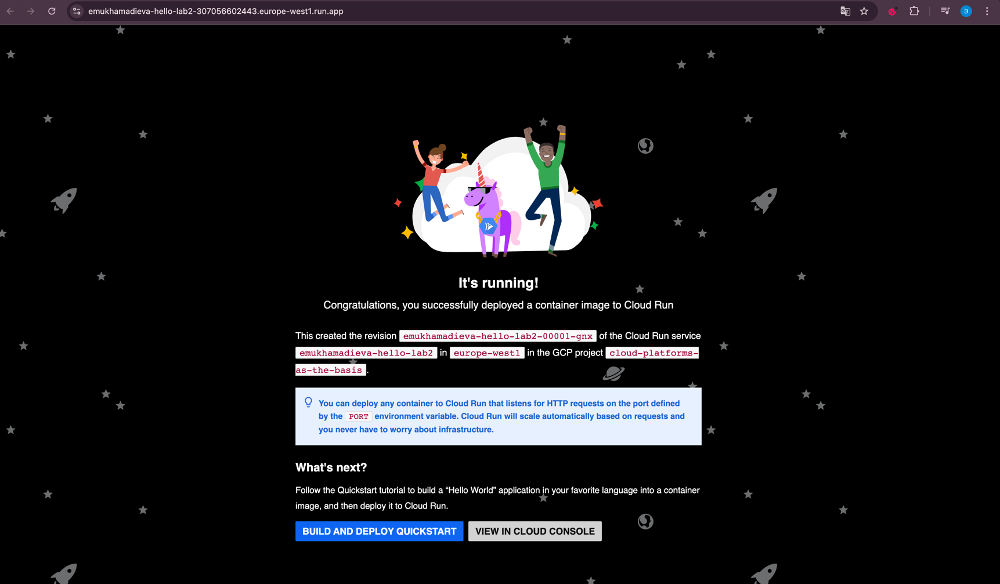

### 7. Логи после смены порта

Логи новой ревизии (с портом 8090) не отличаются от логов исходной — контейнер запустился штатно, так как Cloud Run корректно передал новое значение через `$PORT`. Это подтверждает, что изменение порта в настройках сервиса не нарушает работу образа `hello`.

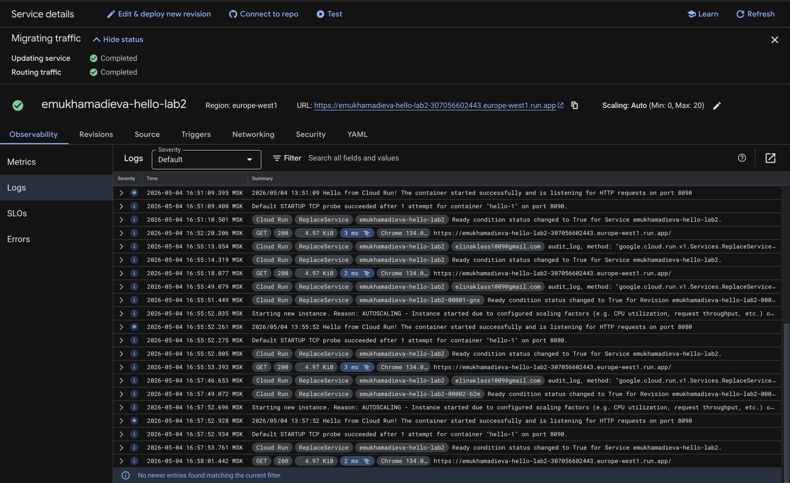

### 8. Управление трафиком между ревизиями

Через **Manage traffic** был настроен сплит трафика между двумя ревизиями:
- `emukhamadieva-hello-lab2-00002-b2m` (ревизия с портом 8090) — **40%**
- `emukhamadieva-hello-lab2-00001-gnx` (исходная ревизия с портом 8080) — **60%**

Обе ревизии работали корректно, что позволило протестировать механизм постепенного переключения трафика между версиями без прерывания сервиса.

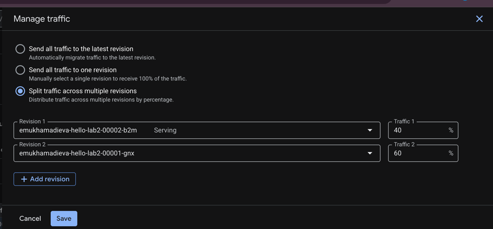

### 9. Логи при переключении трафика

В логах при активном сплите трафика видны одновременные записи от обеих ревизий. Это наглядно демонстрирует, как Cloud Run распределяет трафик между версиями.

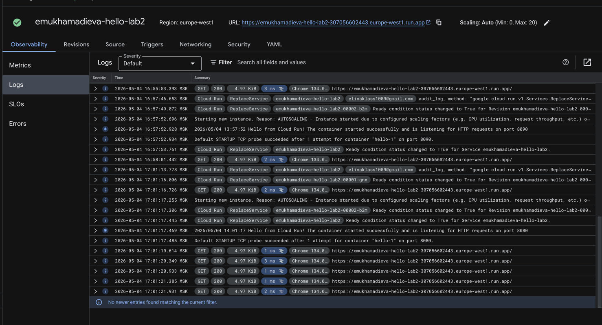

### 10. Метрики после сплита трафика

После настройки разделения трафика метрики показали увеличение количества запросов. По завершении работы все созданные сервисы были удалены.

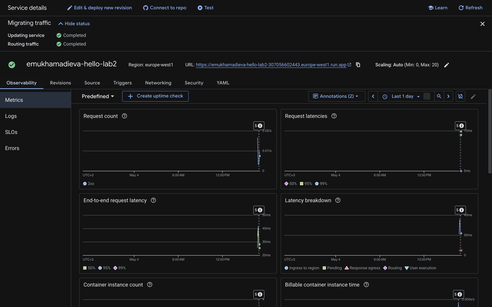
