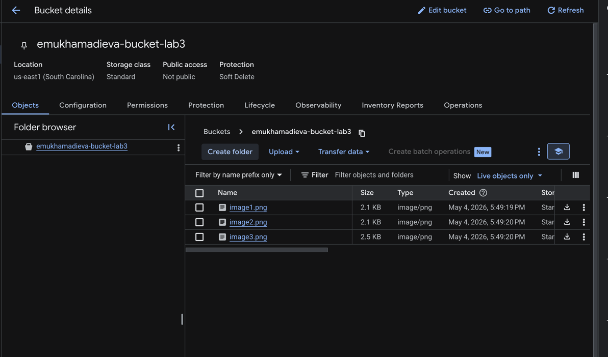
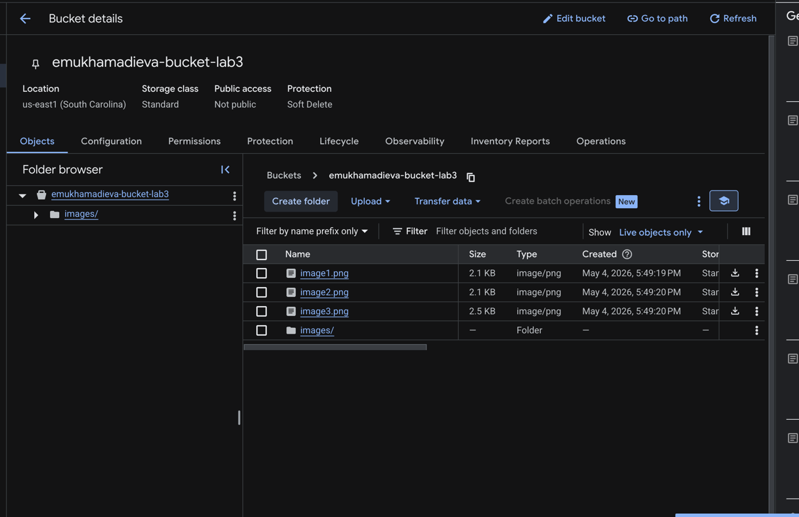
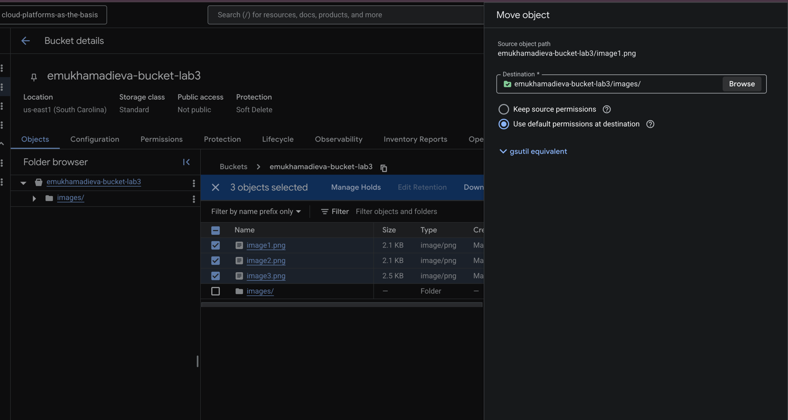
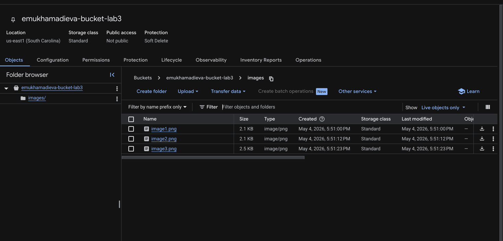
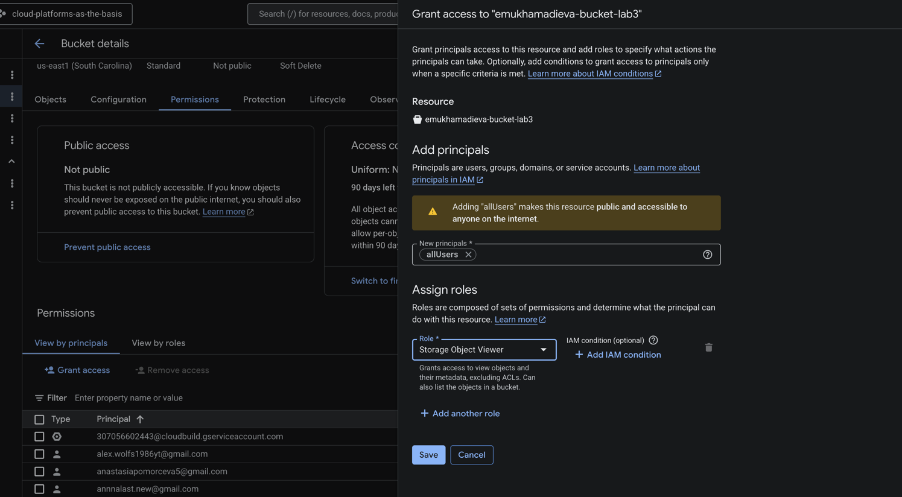
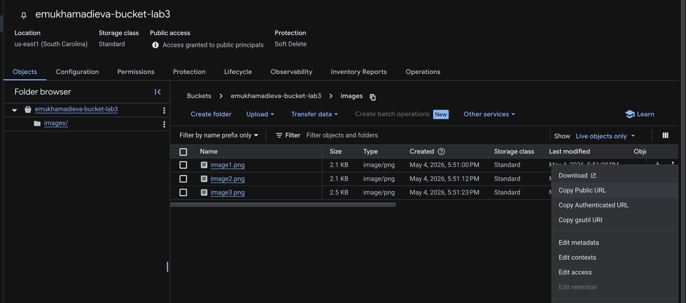
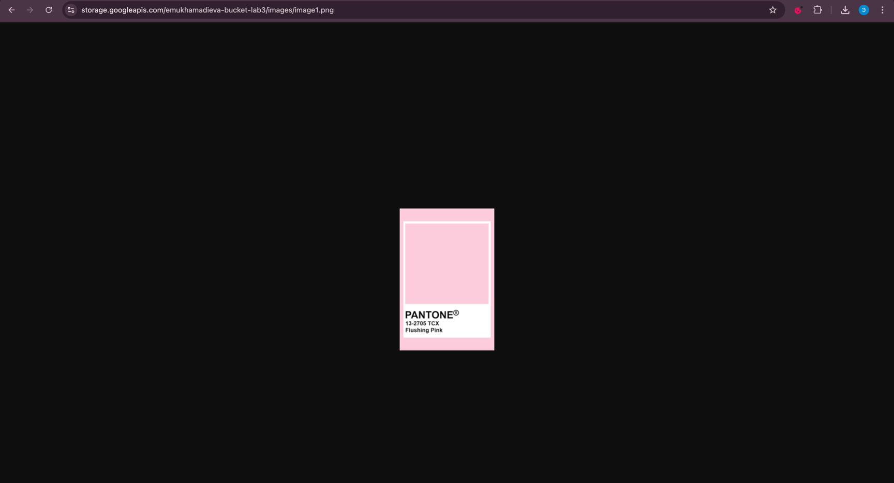

University: [ITMO University](https://itmo.ru/ru/) \
Faculty: [FICT](https://fict.itmo.ru) \
Course: [Cloud platforms as the basis of technology entrepreneurship](https://itmo-ict-faculty.github.io/cloud-platforms-as-the-basis-of-technology-entrepreneurship/) \
Year: 2025/2026 \
Group: U4125 \
Author: Mukhamadieva Elina Varisovna \
Lab: Lab3 \
Date of create: 04.05.2026 \
Date of finished: 04.05.2026

---

## Цель работы

Ознакомиться с основными понятиями и принципами работы облачного хранилища, изучат различные модели хранения данных (блок, файл, объектное хранилище), познакомятся с основными сервисами и функционалом, предоставляемым облачными хранилищами.

---

## Ход работы

### 1. Создание Cloud Storage bucket и загрузка изображений

Был создан бакет `emukhamadieva-bucket-lab3`. После создания бакета в него были загружены три изображения: `image1.png`, `image2.png`, `image3.png`.

---

### 2. Создание папки внутри бакета

Внутри бакета была создана папка `images/`. На скриншоте видно, что папка появилась рядом с загруженными файлами.

---

### 3. Перемещение файлов в папку

Все три файла были выделены и перемещены в папку `images/` с помощью операции Move object. В качестве пути назначения указан `emukhamadieva-bucket-lab3/images/`.

---

### 4. Файлы внутри папки

После перемещения все три файла (`image1.png`, `image2.png`, `image3.png`) оказались внутри папки `images/` в бакете.

---

### 5. Настройка публичного доступа

В настройках разрешений бакета был выдан публичный доступ: принципал `allUsers` получил роль `Storage Object Viewer`. Это открывает доступ на чтение объектов бакета для всех пользователей интернета.

---

### 6. Получение публичной ссылки

Через контекстное меню файла была скопирована публичная ссылка (Copy Public URL). На скриншоте видно, что в шапке бакета теперь отображается статус `Access granted to public principals`.

---

### 7. Проверка публичной ссылки

Публичная ссылка вида `https://storage.googleapis.com/emukhamadieva-bucket-lab3/images/image1.png` была открыта в браузере, изображение успешно загружается без авторизации.

---
Все созданные ресурсы были удалены.
