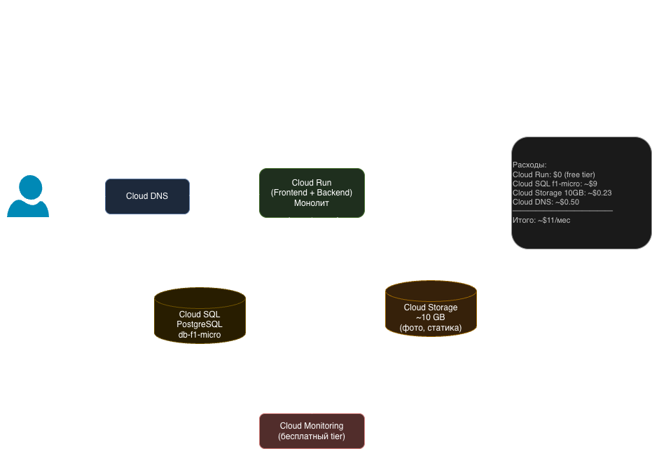
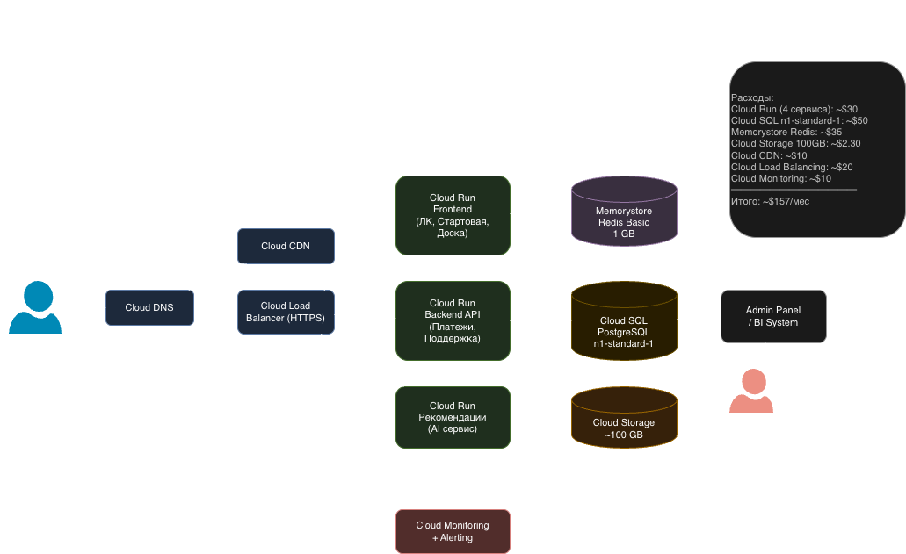
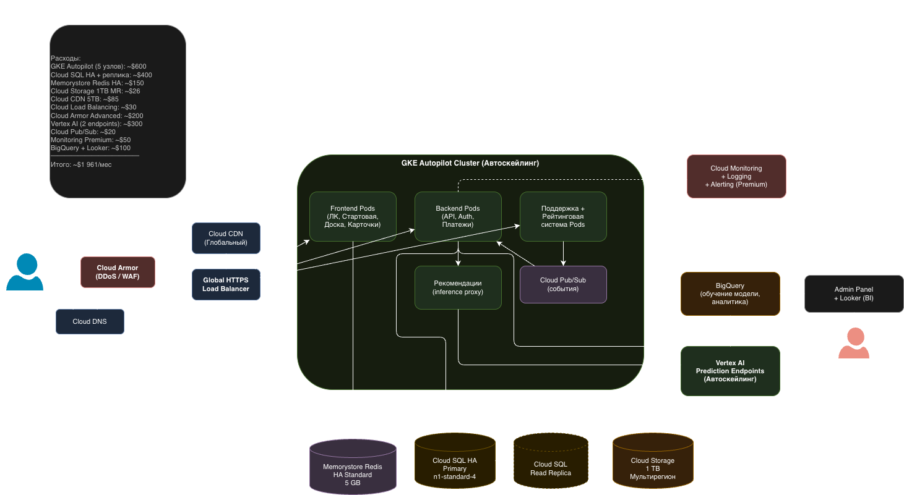

University: [ITMO University](https://itmo.ru/ru/) \
Faculty: [FICT](https://fict.itmo.ru) \
Course: [Cloud platforms as the basis of technology entrepreneurship](https://itmo-ict-faculty.github.io/cloud-platforms-as-the-basis-of-technology-entrepreneurship/) \
Year: 2025/2026 \
Group: U4125 \
Author: Mukhamadieva Elina Varisovna \
Lab: Lab4 \
Date of create: 04.05.2026 \
Date of finished:

---

## Цель работы

Создать прототип AI-приложения с базовой функциональностью: спроектировать инфраструктуру, рассчитать экономическую модель и обосновать выбор облачных ресурсов для трёх стадий жизненного цикла продукта.

---

## Описание приложения

**Приложение:** площадка по вторичной продаже вещей, техники и другого имущества (доска объявлений с AI-рекомендациями).

**AI-компонент:** система рекомендаций на основе поведения пользователей и характеристик товаров.

**Функциональные модули:**

| Модуль | Frontend | Backend |
|---|---|---|
| Стартовая страница | ✓ | ✓ |
| Форма регистрации | ✓ | ✓ |
| Личный кабинет | ✓ | ✓ |
| Система рекомендаций | — | ✓ |
| Карточки товаров | ✓ | ✓ |
| Доска объявлений | ✓ | ✓ |
| Система платежей | ✓ | ✓ |
| Система поддержки пользователей | ✓ | ✓ |
| Система уведомлений | — | ✓ |
| Форма обратной связи | ✓ | ✓ |
| Рейтинговая система | ✓ | ✓ |
| BI System / Admin panel | — | ✓ |
| Мониторинг / Логирование / Алертинг | — | ✓ |

**Ожидаемые нагрузки по стадиям:**
- Стадия 1 (MVP): до 100 пользователей
- Стадия 2 (тестирование партнёрами): до 5 000 пользователей
- Стадия 3 (продакшн): до 1 000 000 пользователей/час

---

## Ход работы

### Стадия 1 — MVP (до 100 пользователей)

**Цель:** максимально дёшево запустить рабочий прототип, подтвердить гипотезу, получить первую обратную связь.

**Выбранная стратегия:** монолитное приложение на одном сервере, минимальная база данных, объектное хранилище для медиа.

**Инфраструктура (GCP):**

| Ресурс | Конфигурация | Обоснование |
|---|---|---|
| Cloud Run (frontend + backend) | 1 vCPU, 512 MB, serverless | Нет постоянной нагрузки — платим только за реальные запросы; бесплатный tier покрывает 2M запросов/мес |
| Cloud SQL (PostgreSQL) | db-f1-micro, 1 GB SSD | Минимальная управляемая БД; shared core достаточно для 100 пользователей |
| Cloud Storage | Стандартный класс, ~10 GB | Хранение фото объявлений, статика |
| Cloud DNS | 1 зона | Регистрация домена, 4 DNS-записи (A, CNAME, MX, TXT) |
| Cloud Monitoring | Бесплатный tier | Базовые метрики и логи |

**Схема инфраструктуры (Стадия 1):**

**Экономическая модель — Стадия 1:**

| Ресурс | Стоимость/мес |
|---|---|
| Cloud Run | $0 (в рамках free tier) |
| Cloud SQL db-f1-micro | ~$9 |
| Cloud Storage 10 GB | ~$0.23 |
| Cloud DNS | ~$0.50 |
| Домен (.ru/.com) | ~$1 (амортизация) |
| **Итого** | **~$11/мес** |

---

### Стадия 2 — Тестирование партнёрами (до 5 000 пользователей)

**Цель:** подключить первых партнёров, проверить нагрузку, начать собирать данные для AI-рекомендаций. Важно не потерять партнёров из-за нестабильности.

**Выбранная стратегия:** переход к микросервисной архитектуре, добавление кэширования, CDN для статики, отдельный сервис рекомендаций.

**Инфраструктура (GCP):**

| Ресурс | Конфигурация | Обоснование |
|---|---|---|
| Cloud Run (несколько сервисов) | До 4 vCPU на каждый сервис, автоскейлинг | Разделяем монолит на ключевые сервисы; Cloud Run масштабируется автоматически |
| Cloud SQL (PostgreSQL) | db-n1-standard-1, 1 vCPU, 3.75 GB RAM, 50 GB SSD | Больше транзакций — нужен выделенный процессор |
| Memorystore (Redis) | Basic tier, 1 GB | Кэш сессий и популярных товаров; снижает нагрузку на БД |
| Cloud Storage | Стандартный класс, ~100 GB | Рост контента объявлений |
| Cloud CDN | Подключён к Load Balancer | Ускорение отдачи статики для пользователей по всей стране |
| Cloud Load Balancing | HTTP(S) LB | Распределение трафика между сервисами |
| Cloud Monitoring + Alerting | Основной tier | Алертинг при деградации — критично для партнёров |

**Схема инфраструктуры (Стадия 2):**

**Экономическая модель — Стадия 2:**

| Ресурс | Стоимость/мес |
|---|---|
| Cloud Run (4 сервиса) | ~$30 |
| Cloud SQL db-n1-standard-1 | ~$50 |
| Memorystore Redis Basic 1 GB | ~$35 |
| Cloud Storage 100 GB | ~$2.30 |
| Cloud CDN (500 GB исходящего трафика) | ~$10 |
| Cloud Load Balancing | ~$20 |
| Cloud Monitoring | ~$10 |
| **Итого** | **~$157/мес** |

---

### Стадия 3 — Продакшн (до 1 000 000 пользователей/час)

**Цель:** обеспечить высокую доступность (SLA 99.9%), горизонтальное масштабирование, защиту от DDoS, надёжное хранение данных с репликацией.

**Выбранная стратегия:** GKE (Kubernetes) с автоскейлингом, Cloud SQL с read-репликами и HA, Vertex AI для рекомендаций, Cloud Armor для защиты.

**Инфраструктура (GCP):**

| Ресурс | Конфигурация | Обоснование |
|---|---|---|
| GKE Autopilot | Автоскейлинг pod'ов | Оркестрация микросервисов при пиковых нагрузках 1M req/ч; Autopilot управляет нодами автоматически |
| Cloud SQL HA (PostgreSQL) | db-n1-standard-4, 4 vCPU, 15 GB RAM, read-реплика | Основная БД + реплика для чтения; failover при отказе основного узла |
| Memorystore Redis HA | Standard tier, 5 GB | Высокодоступный кэш с автофейловером; критично при 1M пользователей |
| Cloud Storage | Стандартный класс, 1 TB, мультирегион | Хранение медиа с geo-репликацией |
| Cloud CDN | Глобальный | Кэширование статики у пользователей по всей России |
| Cloud Load Balancing | Global HTTPS LB | Балансировка с SSL termination и health checks |
| Cloud Armor | Managed protection (Advanced) | Защита от DDoS и WAF-правила |
| Vertex AI | Managed ML endpoints | Production-grade рекомендательная система; автоскейлинг inference |
| Cloud Pub/Sub | Standard tier | Асинхронная обработка событий (новые объявления, платежи) |
| Cloud Monitoring + Logging | Premium | Полный observability stack: метрики, трейсы, логи, алертинг |
| BigQuery + Looker | Standard | BI-аналитика поведения пользователей и продаж |

**Схема инфраструктуры (Стадия 3):**

**Экономическая модель — Стадия 3:**

| Ресурс | Стоимость/мес |
|---|---|
| GKE Autopilot (avg 5 узлов n2-standard-4) | ~$600 |
| Cloud SQL HA (db-n1-standard-4 + реплика) | ~$400 |
| Memorystore Redis HA 5 GB | ~$150 |
| Cloud Storage 1 TB (мультирегион) | ~$26 |
| Cloud CDN (5 TB исходящего трафика) | ~$85 |
| Cloud Load Balancing | ~$30 |
| Cloud Armor Advanced | ~$200 |
| Vertex AI (2 endpoints, autoscaling) | ~$300 |
| Cloud Pub/Sub | ~$20 |
| Cloud Monitoring + Logging Premium | ~$50 |
| BigQuery + Looker | ~$100 |
| **Итого** | **~$1 961/мес** |

---

## Сравнительная таблица стадий

| Параметр | Стадия 1 (MVP) | Стадия 2 (Партнёры) | Стадия 3 (Продакшн) |
|---|---|---|---|
| Пользователей | до 100 | до 5 000 | до 1 000 000/час |
| Архитектура | Монолит, Cloud Run | Микросервисы, Cloud Run | GKE, автоскейлинг |
| БД | Cloud SQL f1-micro | Cloud SQL n1-standard-1 | Cloud SQL HA + реплика |
| Кэш | — | Redis Basic 1 GB | Redis HA 5 GB |
| AI/ML | — | Cloud Run (простая ML-модель) | Vertex AI managed |
| Защита | — | — | Cloud Armor (DDoS/WAF) |
| CDN | — | ✓ | ✓ Глобальный |
| BI | — | Admin panel | BigQuery + Looker |
| SLA | Best effort | ~99.5% | 99.9%+ |
| Стоимость/мес | **~$11** | **~$157** | **~$1 961** |

---

## Обоснование выбора ресурсов

**Cloud Run (Стадии 1–2)** выбран за serverless-модель: при малой нагрузке не платим за простой, при пиках — автоматически масштабируется. Это оптимально для MVP и тестирования, где нагрузка непредсказуема.

**GKE Autopilot (Стадия 3)** заменяет Cloud Run при переходе к 1M пользователей: даёт полный контроль над ресурсами, поддерживает stateful-сервисы, позволяет настраивать pod affinity, resource limits и HPA. Autopilot снимает overhead по управлению нодами.

**Cloud SQL вместо самоуправляемой БД** выбран потому, что управляемый сервис включает автобэкапы, мониторинг, патчинг и failover из коробки. На ранних стадиях это экономит время разработчиков.

**Vertex AI (Стадия 3)** выбран для AI-рекомендаций: не нужно самостоятельно управлять ML-инфраструктурой, автоскейлинг inference эндпоинтов, интеграция с BigQuery для обучения на реальных данных пользователей.

**Cloud Armor только на Стадии 3** — DDoS-защита дорогостоящая ($200/мес), но при 1M пользователей риски и потенциальный ущерб от атаки несопоставимо выше затрат на защиту.

**Нецелесообразность самого дешёвого решения с первого шага:** переход сразу к GKE и Vertex AI на MVP увеличил бы расходы в 178 раз (`$11` → `$1 961`) при нагрузке в 10 000 раз меньше. При этом сложность инфраструктуры замедлила бы итерации и обратную связь. Правильный путь — расти поэтапно, когда нагрузка требует следующего уровня.

---

## Вывод

В ходе работы была спроектирована инфраструктура AI-приложения (площадка вторичных продаж с системой рекомендаций) для трёх стадий жизненного цикла. Показано, что оптимальный выбор ресурсов меняется вместе с нагрузкой: от serverless-монолита за `$11/мес` до распределённой GKE-архитектуры за `~$2 000/мес`. Поэтапный рост позволяет минимизировать расходы на ранних стадиях и обеспечить надёжность на продакшне.